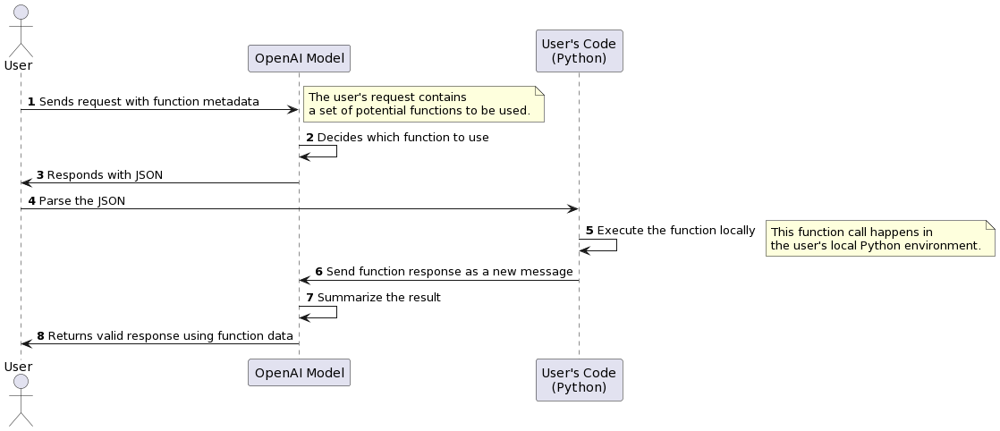

# [openai-functools](https://github.com/Jakob-98/openai-functools)

`openai-functools` is a Python library designed to enhance the functionality of OpenAI's `gpt-3.5-turbo-0613` and `gpt-4-0613` models for function calling, [ref. the OpenAI official docs](https://platform.openai.com/docs/guides/gpt/function-calling). This library focuses on generating the function metadata JSON automatically by wrapping existing Python functions in our decorator, or by registering them with our orchestrator. This removes the need for you to manually create and manage the JSON structures required for function calling in these models.

## Why openai-functools

The image below illustrates the reduction of code which needs to be manually written. The snippets in green are interchangeable with use of our library.


### ?... So what is OpenAI Function Calling?

OpenAI function calling provides a powerful mechanism to extend the capabilities of AI models, like gpt-3.5-turbo-0613 and gpt-4-0613. In an API call, these models can understand a set of functions described to them and generate JSON outputs that adhere to the defined function signatures.

These models *don't actually perform the function calls* - they merely generate the JSON data that you can use in your code to call these functions. This ability allows for a wide range of applications, such as creating chatbots that call external APIs, converting natural language into API calls, and extracting structured data from text.

Typical openai functions flow:



[ref. the OpenAI official docs](https://platform.openai.com/docs/guides/gpt/function-calling).

## Installation

This package is hosted on PyPI and can be installed with pip:

```sh
pip install openai-functools
```

Alternatively, you can clone this repository and install with Poetry:

```sh
git clone https://github.com/Jakob-98/openai-functools.git
cd openai-functools
poetry install
```

Ensure your environment variable `OPENAI_API_KEY` is set.

## Usage

This library is designed to streamline the usage of OpenAI's language models by simplifying the function metadata creation process. The following sections will walk you through a basic usage of openai-functools, including a traditional manual approach and our enhanced automatic approach using the `openai_function` decorator.

### Manual Approach

Traditionally, you'd define a function, like `get_current_weather`, and then manually create a JSON structure that describes this function. The structure includes the function name, description, and parameters it takes, as well as the types of these parameters.

```python
def get_current_weather(location, unit="fahrenheit"):
    weather_info = {
        "location": location,
        "temperature": "72",
        "unit": unit,
        "forecast": ["sunny", "windy"],
    }
    return json.dumps(weather_info)

def run_conversation():
    messages = [{"role": "user", "content": "What's the weather like in London?"}]
    functions = [
        {
            "name": "get_current_weather",
            "description": "Get the current weather in a given location",
            "parameters": {
                "type": "object",
                "properties": {
                    "location": {
                        "type": "string",
                        "description": "The city and state, e.g. San Francisco, CA",
                    },
                    "unit": {"type": "string", "enum": ["celsius", "fahrenheit"]},
                },
                "required": ["location"],
            },
        }
    ]
    # Proceed with calling openai, invoking the function using the response, etc..
```

### Automated Approach using openai-functools

The `openai-functools` library simplifies the process by automatically generating the necessary JSON structure. You just need to import our package and wrap your function with the `openai_function` decorator. Here's how it works:

```python
import json
from openai_functools import openai_function

@openai_function
def get_current_weather(location, unit="fahrenheit"):
    weather_info = {
        "location": location,
        "temperature": "72",
        "unit": unit,
        "forecast": ["sunny", "windy"],
    }
    return json.dumps(weather_info)

def run_conversation():
    messages = [{"role": "user", "content": "What's the weather like in London?"}]
    functions = [
        get_current_weather.openai_metadata
    ]
```

As you can see, our `openai_function` decorator allows you to focus more on the logic of your function, while the tedious task of preparing function metadata is taken care of automatically.

### Using the Orchestrator

The orchestrator in `openai-functools` simplifies the task of managing multiple registered functions and automates the generation of OpenAI function descriptions. Below is a guide on how to use it.

```python
from openai_functools import FunctionsOrchestrator

def get_current_weather(location, unit="fahrenheit"):
    """Get the current weather forecast in a given location"""
    # ... Implementation here

def get_weather_next_day(location, unit="fahrenheit"):
    """Get the weather forecast for the next day in a given location"""
    # ... Implementation here

orchestrator = FunctionsOrchestrator()
orchestrator.register_all([get_current_weather, get_weather_next_day])
# ...
```

#### Registering Functions

Functions can be registered using the `register_all` or `register` method as shown in the code snippet above. `register_all` accepts a list of functions, while `register` is used to register a single function.

### Creating and Using Function Descriptions

Function descriptions are automatically created based on the registered functions using `create_function_descriptions` method. These descriptions can then be passed to the OpenAI `ChatCompletion.create` method.

```python
response = openai.ChatCompletion.create(
    model="gpt-3.5-turbo-0613",
    messages=[{"role": "user", "content": "What's the weather like in Boston?"}],
    functions=orchestrator.create_function_descriptions(),
    function_call="auto",
)
```

### Calling Functions Based on the OpenAI Response

The `call_function` method is used to call a function based on the OpenAI response. It fetches the function call data from the response, finds the matching function from the registered functions, and calls it with the provided arguments.

```python
function_results = orchestrator.call_function(response)
```

This process can be repeated for subsequent interactions with the OpenAI model, allowing easy use of multiple functions in a conversational context.

```python
response = openai.ChatCompletion.create(
    model="gpt-3.5-turbo-0613",
    messages=[{"role": "user", "content": "What's the weather like in Boston tomorrow?"}],
    functions=orchestrator.create_function_descriptions(),
    function_call="auto",
)
function_results = orchestrator.call_function(response)
```

## Using docstrings to enhance metadata

By using docstrings in your functions, we are able to extract more information to fill in the descriptions of the function and its properties. This will automatically be added to the openai function metadata, and will help the model better understand the functions and parameters.

Currently, only "reStructuredText" (reST) is supported by default, although this can be extended in the future (feel free to contribute!). Under the hood we make use of [docstring parser](https://pypi.org/project/docstring-parser/) to enable this.

## Examples

Several examples can be found in the `examples` directory of this repository.

1. The [Maintenance app usecase](./examples/maintenance_app_usecase/) is the recommended example to analyse, it shows the power of the library in a (spoofed) real-world setting.
1. The [Naive approach example](./examples/naive_approach.py) shows how to call openai-functions without use of the library.
1. The [Simple example](./examples/simple_example.py) is similar to the naive approach, but makes use our decorator.
1. The [Orchestrator example](./examples/orchestrator_example.py) shows how one can use the orchestrator class.

## Contributing

We welcome contributions to `openai-functools`! Please see our [contributing guide](CONTRIBUTING.md) for more details.

## Support

For support with `openai-functools`, please open an issue on this GitHub repository. We will do our best to assist you.

## License

`openai-functools` is licensed under the MIT license. See the [LICENSE](LICENSE) file for details.
